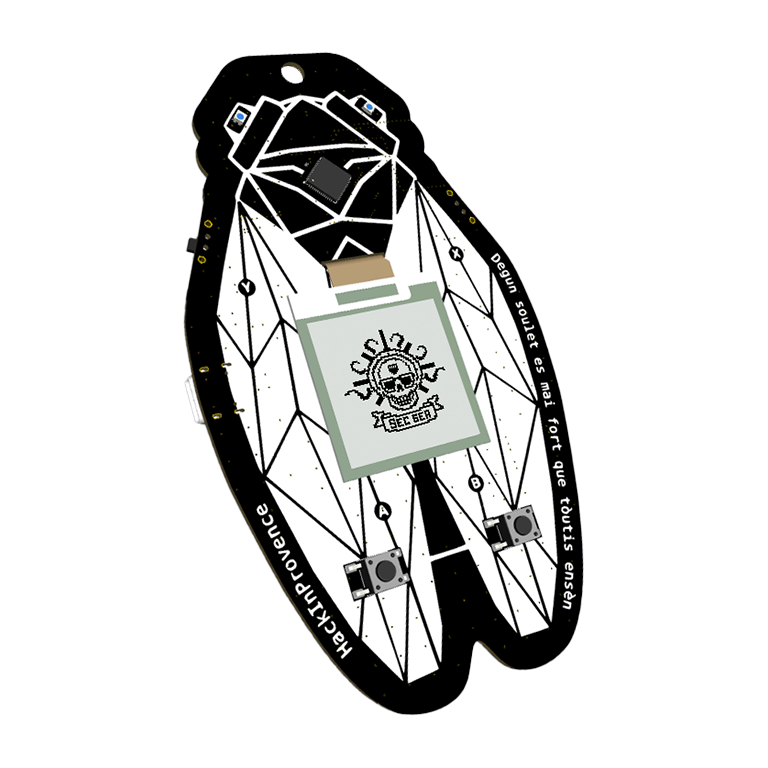

# Badge SecSea 2025



- base RP2040 (Raspberry Pi Pico),
- flash 16Mo,
- boutons,
- [ ] buzzer,
- [ ] LEDs WS2812,
- [ ] chargeur,
- [ ] radio CC1101,
- [ ] écran [e-Paper 200x200 en SPI](https://www.waveshare.com/wiki/1.54inch_e-Paper_Module_Manual),
- [ ] chipselect sur SPI0.


## Hardware


## Software

Basé sur le pico SDK, écrit en C, compilé via cmake + make/ninja.


### Pico C SDK

Le pico SDK est similaire à l'approche bare-metal.
Ce sont des fonctions C réalisant une abstraction pour accéder aux fonctionnalités du RP2040 plus facilement.

Pourquoi abstraire ?
Par exemple, le PWM fonctionne en 2 blocs de 8 tranches, et chaque tranche contrôle 2 sorties.
On peut régler l'activation, le mode (output ou input), la fréquence et le duty cycle de chaque GPIO via des `registres`
(par exemple le bit 0 de l'octet `0x40050000` active ou désactive la tranche des pins 0 et 1).
De son côté, le SDK fournit la fonction `pwm_set_enabled` qu'on peut appeler pour effectuer cette écriture.
Le SDK fournit les abstractions pour accélérer un peu le travail sur le RP2040
(et les faire correctement avec par exemple dans le cas précédent ne pas modifier les autres bits du registre),
et rendre les choses (un peu) plus lisibles.

Le SDK ne constitue pas un OS : il n'y a pas de notion de process, thread, tâches concurrentes, mémoire virtuelle, système de fichier, droits d'accès...

Le SDK et les exemples peuvent suffire à piloter nos périphériques.
C'est le cas si on utilise le buzzer pour faire un son régulier (via PWM, comme une mélodie),
piloter les LEDs via le protocole WS2812 ([example pio/ws2812](https://github.com/raspberrypi/pico-examples/tree/master/pio/ws2812)),
utiliser le SPI (pour le CC1101 et l'écran).
Mais ce ne sera pas le cas pour tout, comme par exemple faire un son de cigale plus réaliste ou afficher quelques chose sur l'écran.

Le SDK est à installer.
Le [document getting started](https://datasheets.raspberrypi.com/pico/getting-started-with-pico.pdf) détaille les étapes pour VSCode.
Les étapes pour une installation manuelle sont les suivantes (il faut un gestionnaire de paquet type `apt`, donc Debian/Ubuntu...) :

```
cd ~/Downloads
wget https://raw.githubusercontent.com/raspberrypi/pico-setup/master/pico_setup.sh
chmod +x pico_setup.sh
# Vous pouvez changer de dossier si vous voulez l'installer ailleurs.
# Le script installe la toolchain dans ./pico/ (qu'il crée avec l'utilisateur courant, pas besoin de sudo).
# Il installe également les exemples dans ./pico/pico-examples, et en compile certains.
./pico_setup.sh
export PICO_SDK_PATH="$PWD/pico/pico-sdk"
```

En cas de doutes, problèmes, questions supplémentaires, la [doc en ligne](https://www.raspberrypi.com/documentation/microcontrollers/pico-series.html) apporte des liens supplémentaires.


### Ce dépôt

Ce dépôt contient le code de l'application du badge et ses dépendances supplémentaires à l'exception du pico SDK.


#### Compiler et Flasher

```bash
export PICO_SDK_PATH="$PWD/pico/pico-sdk"  # A remplacer par votre chemin d'installation
mkdir -p build
cd build
cmake .. -DPICO_BOARD=pico_w  # Pour l'instant je travaille sur une pico_w
cmake -Gninja --build . --target all
```

Pour flasher, commencer par booter le badge en mode flash :
tenir le bouton BOOTLOAD du badge enfoncer et brancher le badge en USB.
Au bout d'une ou deux secondes, on peut lâcher le bouton (un "stockage de masse" a dû apparaître dans les périphériques).

Pour flasher :

```bash
picotool xxx.uf2  # Je n'ai pas encore le nom du fichier final
picotool reboot
```

Sinon, copier directement le fichier `build/*.uf2` vers le "stockage de masse" et débrancher le badge.


#### Architecture


#### Ajouter un module

La manière d'ajouter un module au badge est en gros :

- chercher si un driver existe déjà en C pour le module et l'utiliser/l'adapter,
- si non, chercher quel protocole électrique est utilisé (SPI/I2C/PWM/WS2812/...),
- chercher dans la [datasheet du RP2040](https://datasheets.raspberrypi.com/rp2040/rp2040-datasheet.pdf) comment faire fonctionner ce module,
- être renvoyé vers la [documentation du SDK](https://datasheets.raspberrypi.com/pico/raspberry-pi-pico-c-sdk.pdf) pour savoir quelles fonctions C utiliser,
- réaliser une abstraction supplémentaire : initialisation, configuration du RP et du module,
  implémentation des commandes, éventuellement abstraction plus haut niveau (e.g. jouer une liste de notes).

Le SDK fonctionne avec CMake, ce qui peut être un peu déroutant pour ajouter du nouveau code.
Prendre exemple soit sur les modules de ce dépôt, soit sur les `pico-examples` que vous avez installé avec le SDK.
L'idée est d'ajouter des bibliothèques pour chaque nouveau module, comme conseillé par le SDK.
C'est une bibliothèque au sens CMake, c'est à dire une `INTERFACE` et le code de l'application utilisera cette interface pour trouver le code à utiliser pour votre module.
C'est comme ça que fonctionne le SDK, et seul les abstractions nécessaires au projet sont compilées.
Ce n'est donc pas une bibliothèque au sens C/C++ (code précompilé et assemblé dans un `.so` ou une `.dll`).

Chaque applicatif doit contenir un `main` qui est le point d'entrée du code.
Il n'y a normalement que l'applicatif du badge qui contient déjà un `main`
mais il est possible de créer d'autres applicatifs pour tester des fonctionnalités et développer plus facilement.
