# SecSea badge — every screen

Generated by `tools/badge_screens.py --lang en` (screenshots of the badge in English through its serial port, user and admin modes). The language is chosen in Settings > Language ([translation](translation.md)).

*Version française : [tous les écrans](../fr/ecrans.md).*

## Menu

### Home — The main menu

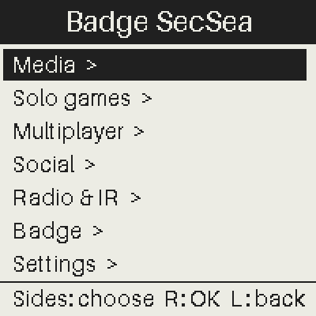

## Media

### Menu — The theme Media

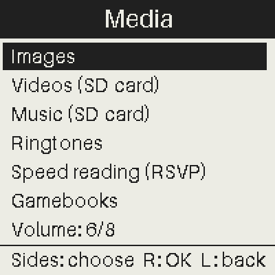

### Images

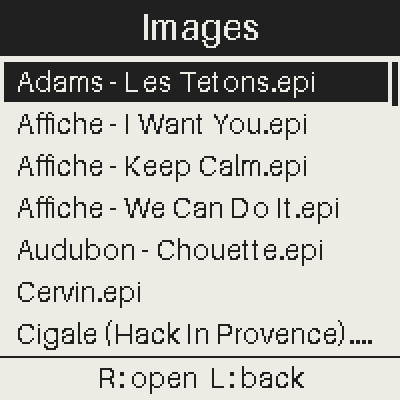

### Images — An image of the SD card

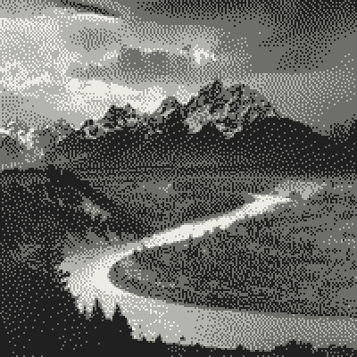

### Videos

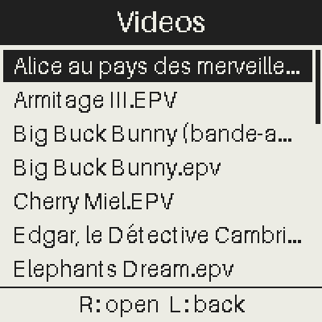

### Videos — Playing a video

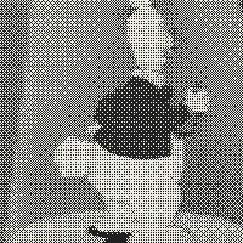

### Music

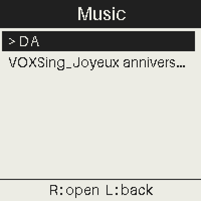

### Music — A folder of music

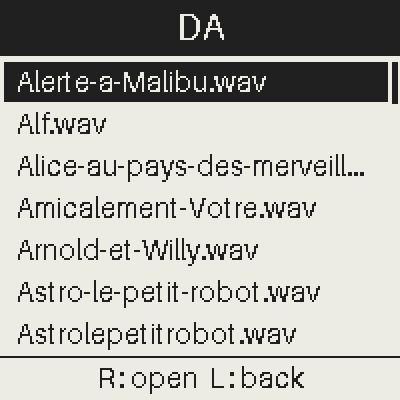

### Music — Playing a music

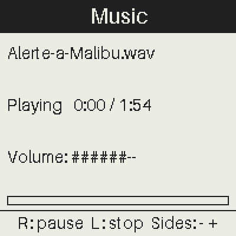

### Ringtones

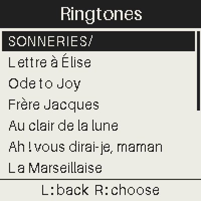

### Ringtones — A ringtone

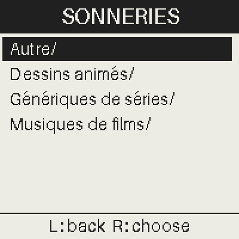

### Speed reading

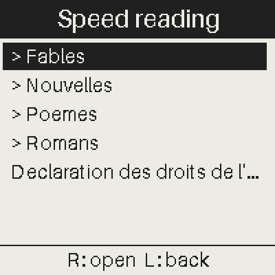

### Speed reading — A folder of texts

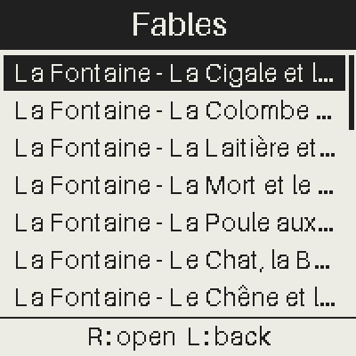

### Speed reading — Reading a text

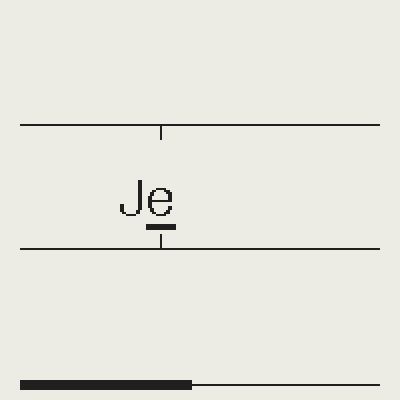

### Gamebooks

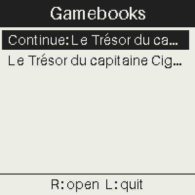

### Gamebooks — A book

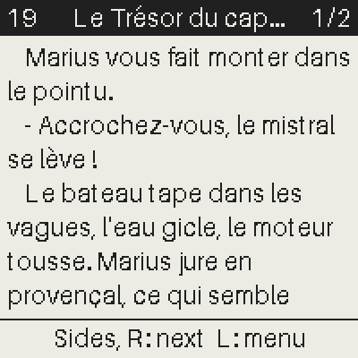

### Gamebooks — Reading

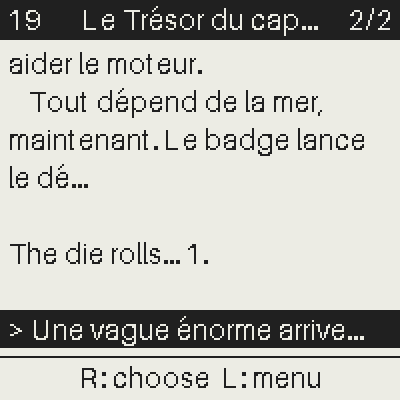

## Solo games

### Menu — The theme Solo games

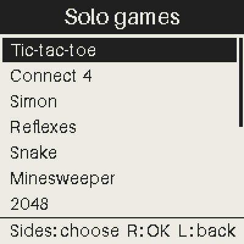

### Tic-tac-toe

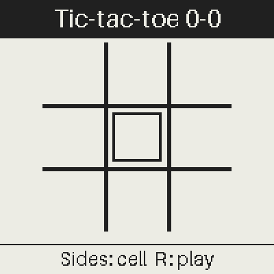

### Tic-tac-toe — The game

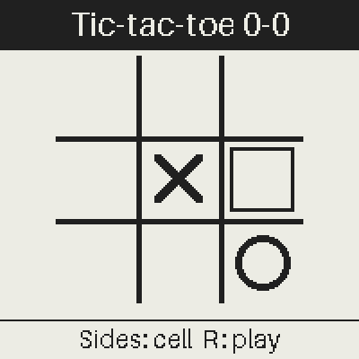

### Connect 4

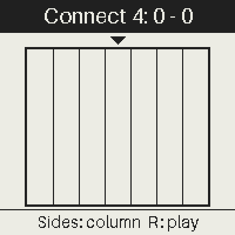

### Connect 4 — The game

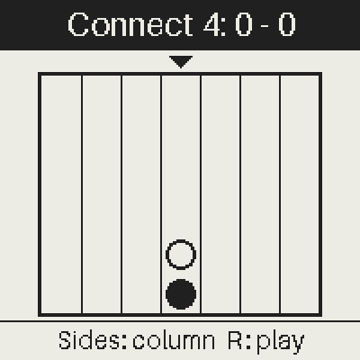

### Simon

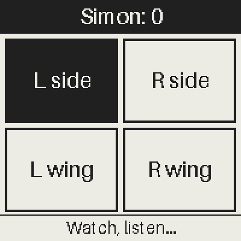

### Simon — The game

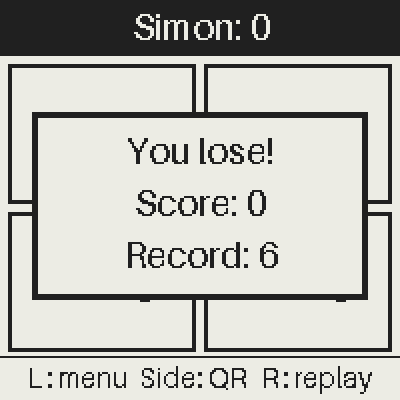

### Reflexes

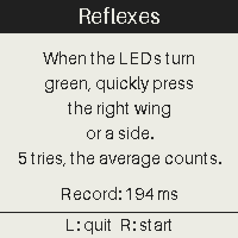

### Reflexes — The game

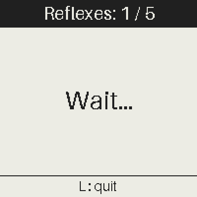

### Snake

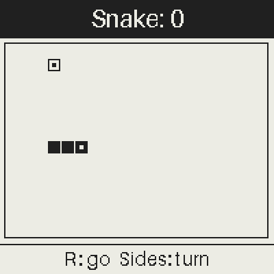

### Snake — The game

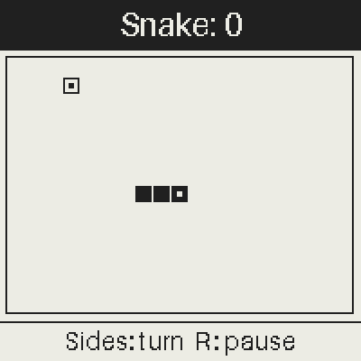

### Minesweeper

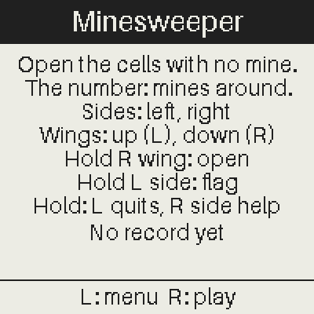

### Minesweeper — The game

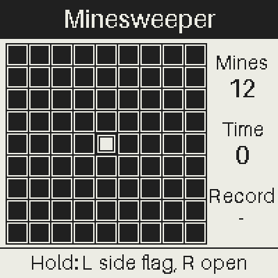

### 2048

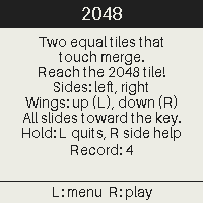

### 2048 — The game

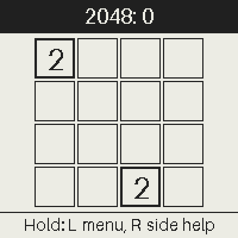

### 15 puzzle

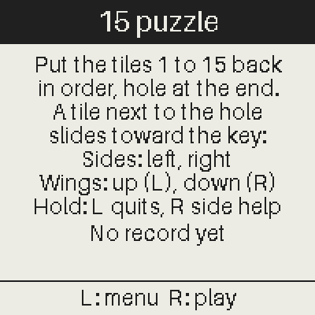

### 15 puzzle — The game

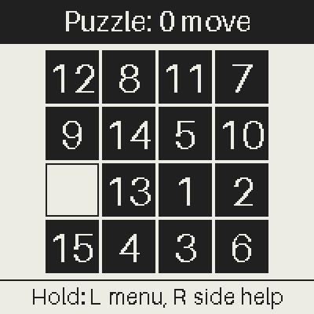

### Sokoban

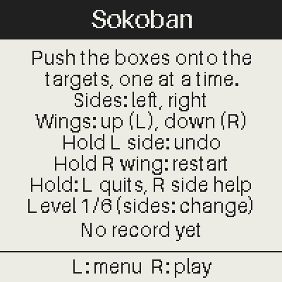

### Sokoban — The game

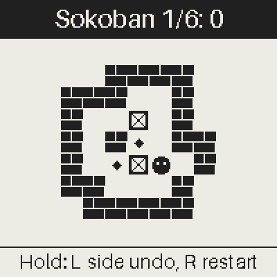

### Mastermind

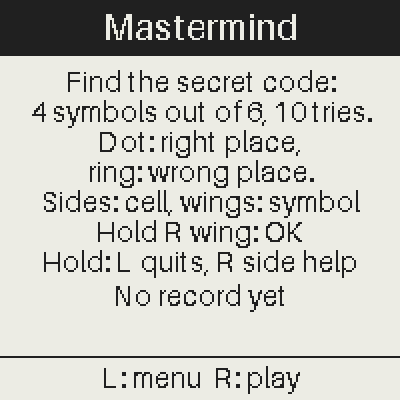

### Mastermind — The game

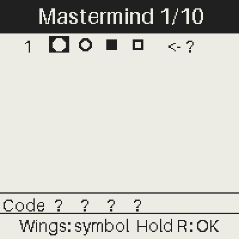

### Hangman

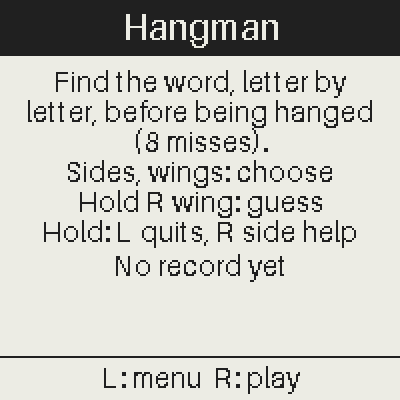

### Hangman — The game

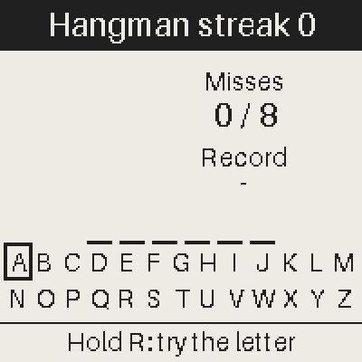

### Blind test

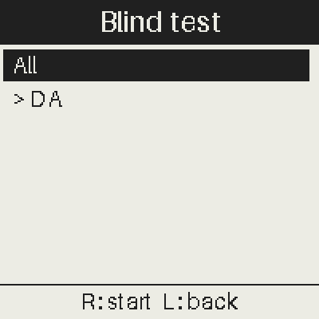

### CTF

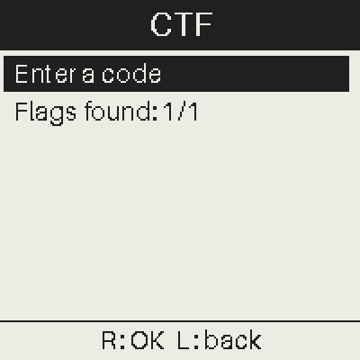

### CTF — Typing a code

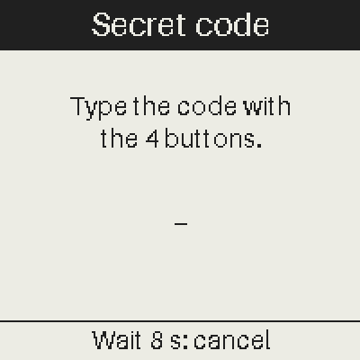

### Crypto CTF

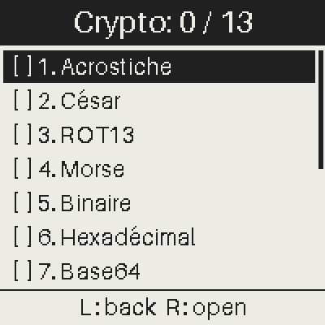

### Crypto CTF — A challenge

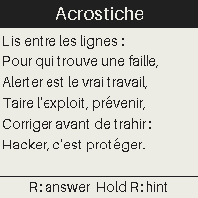

### Crypto CTF — Its hint

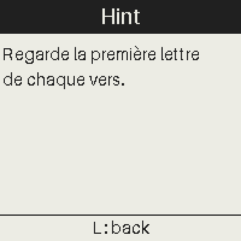

### Crypto CTF — Typing the answer

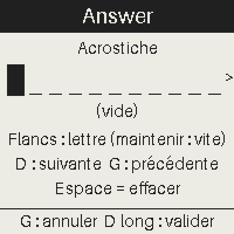

### Crypto CTF — The final flag

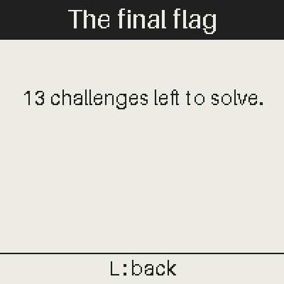

## Multiplayer

### Menu — The theme Multiplayer

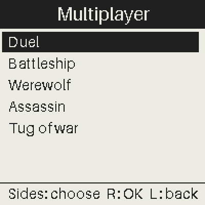

### Duel

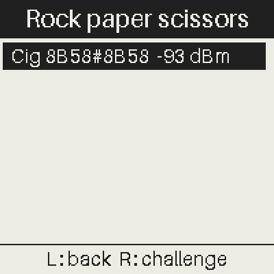

### Battleship

### Werewolf

### Werewolf — Leading a game

### Werewolf — Help: a role card

### Werewolf — Help: the role in detail

### Assassin

### Tug of war

## Social

### Menu — The theme Social

### Cicada network

### Messages

### Messages — Choosing the recipient

### Messages — Choosing the message

### Contacts

### Contacts — My card (checked fields: sent)

### Contacts — Typing a field

### Contacts — Exchanging the cards

### Contacts — Contacts received

### Skills

### Skills — My skills

### Skills — Who shares them?

### Program

### Program — A talk (and its QR code)

### Vote

### Cicada radar

### Hot - cold

### Cicada virus

### Chorus

### Announcements

### Smuggling

### Smuggling — The hold

## Radio & IR

### Menu — The theme Radio & IR

### Carrier

### 433 MHz decoder

### Weather station

### Send an image

### Receive an image

### Infrared

### 433 MHz hunt

### Listen to pirate radio

## Badge

### Menu — The theme Badge

### Name tag

### Lamp

### Lamp — Brighter

### Talk badge

### Talk badge — Green: all is well

### Talk badge — Orange: 5 min

### Talk badge — Red: time is up

### OLED screen

### Achievements

### Achievements — How to get an achievement

## Settings

### Menu — The theme Settings

### Screensaver

### Language

### Info

### Credits

### Credits — Page 2

### Credits — Page 3

### Credits — Page 4

### Credits — Page 5

### Credits — Page 6

### Credits — Page 7

### Credits — Page 8

### Radio tuning

## Admin

### Menu — The theme Admin

### Radio commands

### Cicada LEDs

### Cicada LEDs — The mode

### Cicada LEDs — The blink times

### Cicada LEDs — The fade times

### Cicada LEDs — Send / restore

### Notices (admin)

### Notices (admin) — An announcement: its fields

### Notices (admin) — Typing the time

### Notices (admin) — Typing the text (accented letters)

### Notices (admin) — Preview (the screen of the cicadas)

### Vote (admin)

### Chorus: start

### Hot-cold beacon

### Virus: patient 0

### Smuggling (admin)

### Werewolf (admin)

### Reset

### Reset — The confirmation

### Battery (calibration)

### Pirate radio

### Pirate radio — The settings

### Badge type

## Texts to fix

(none)

## Rows of lists shortened (previews: the page of the row shows it all)

- Médias > Images : list row cut "Cigale (Hack In Provence).epi"
- Médias > Vidéos : list row cut "Alice au pays des merveilles.EPV"
- Médias > Vidéos : list row cut "Big Buck Bunny (bande-annonce).epv"
- Médias > Vidéos : list row cut "Edgar, le Détective Cambrioleur.EPV"
- Médias > Musique : list row cut "VOXSing_Joyeux anniversaire (ID 2194)_LaSonotheque.fr.wav"
- Médias > Musique > Un dossier de musiques : list row cut "Alice-au-pays-des-merveilles.wav"
- Médias > Lecture rapide : list row cut "Declaration des droits de l'homme (1789).txt"
- Médias > Lecture rapide > Un dossier de textes : list row cut "La Fontaine - La Cigale et la Fourmi.txt"
- Médias > Lecture rapide > Un dossier de textes : list row cut "La Fontaine - La Colombe et la Fourmi.txt"
- Médias > Lecture rapide > Un dossier de textes : list row cut "La Fontaine - La Laitière et le Pot au lait.txt"
- Médias > Lecture rapide > Un dossier de textes : list row cut "La Fontaine - La Mort et le Bûcheron.txt"
- Médias > Lecture rapide > Un dossier de textes : list row cut "La Fontaine - La Poule aux oeufs d'or.txt"
- Médias > Lecture rapide > Un dossier de textes : list row cut "La Fontaine - Le Chat, la Belette et le petit Lapin.txt"
- Médias > Lecture rapide > Un dossier de textes : list row cut "La Fontaine - Le Chêne et le Roseau.txt"
- Médias > Livres-jeux : list row cut "Continue: Le Trésor du capitaine Cigalon"
- Médias > Livres-jeux : list row cut "Le Trésor du capitaine Cigalon"
- Médias > Livres-jeux > Un livre : list row cut "Le Trésor du capitaine Cigalon"
- Médias > Livres-jeux > La lecture : list row cut "Le Trésor du capitaine Cigalon"
- Social > Contacts > Ma carte (champs cochés : envoyés) : list row cut "[x] E-mail: monemail@poste.fr"
- Social > Programme : list row cut "15:00 Badge workshop: hack your cicada!"
- Admin > Annonces (admin) : list row cut "09:00 Bienvenue à SecSea 2026 ! Accueil et café"
- Admin > Annonces (admin) : list row cut "10:30 Pause café : rendez-vous au bar"
- Admin > Annonces (admin) : list row cut "12:30 Pause déjeuner : bon appétit !"
- Admin > Annonces (admin) : list row cut "14:00 Reprise des conférences"
- Admin > Annonces (admin) : list row cut "17:30 Remise des prix du CTF"
- Admin > Annonces (admin) : list row cut "18:30 Apéro de clôture : merci à tous !"
- Admin > Annonces (admin) > Une annonce : ses champs : list row cut "Content: https://www.hackinprovence.fr/"
- Admin > Annonces (admin) > Une annonce : ses champs : list row cut "Text: Bienvenue à SecSea 2026 ! Accueil et café"
- Admin > Annonces (admin) > Saisie du texte (lettres accentuées) : list row cut "Content: https://www.hackinprovence.fr/"
- Admin > Annonces (admin) > Saisie du texte (lettres accentuées) : list row cut "Text: Bienvenue à SecSea 2026 ! Accueil et café"
- Admin > Annonces (admin) > Aperçu (l'écran des cigales) : list row cut "Content: https://www.hackinprovence.fr/"
- Admin > Annonces (admin) > Aperçu (l'écran des cigales) : list row cut "Text: Bienvenue à SecSea 2026 ! Accueil et café"
