# Badge SecSea — tous les écrans

Généré par `tools/badge_screens.py` (captures du badge par le port série, mode utilisateur et admin).

## Menu

### Accueil — Le menu principal

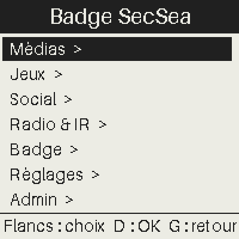

## Médias

### Menu — Le thème Médias

### Images

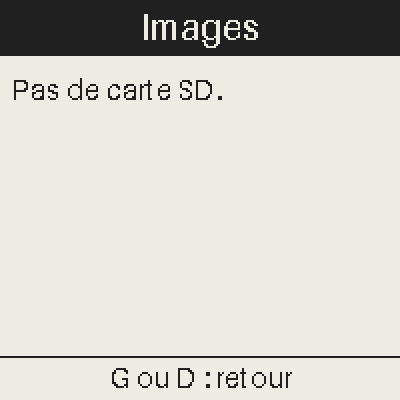

### Images — Une image de la carte SD

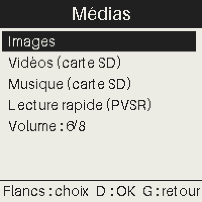

### Vidéos

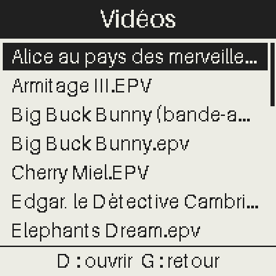

### Vidéos — Lecture d'une vidéo

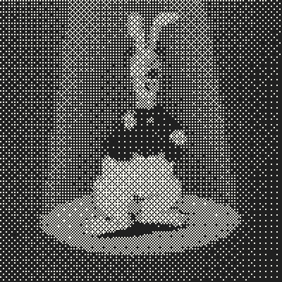

### Musique

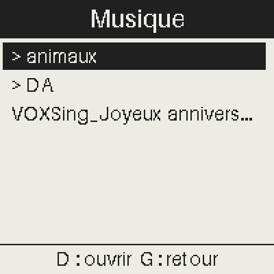

### Musique — Un dossier de musiques

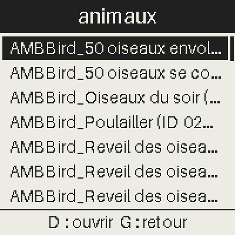

### Musique — Lecture d'une musique

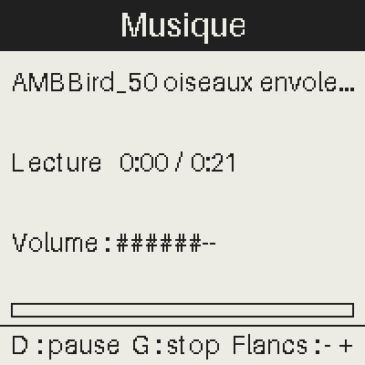

### Sonneries

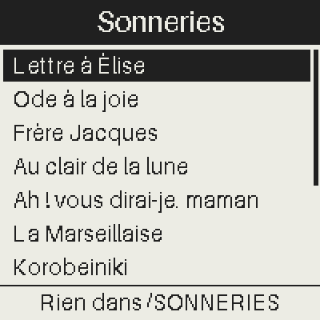

### Sonneries — Une sonnerie

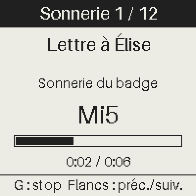

### Lecture rapide

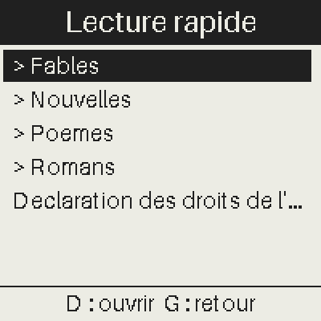

### Lecture rapide — Un dossier de textes

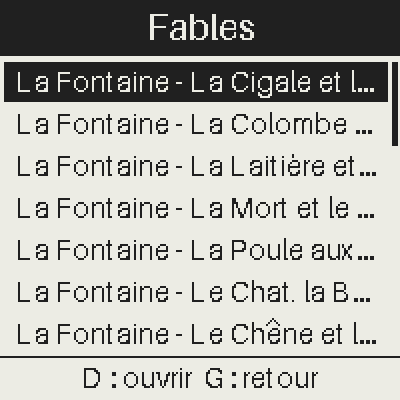

### Lecture rapide — Lecture d'un texte

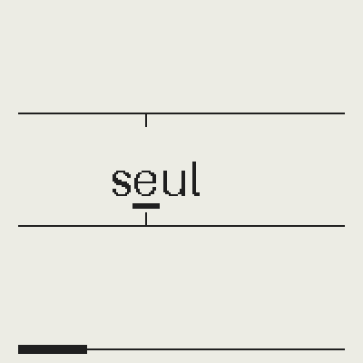

### Livres-jeux

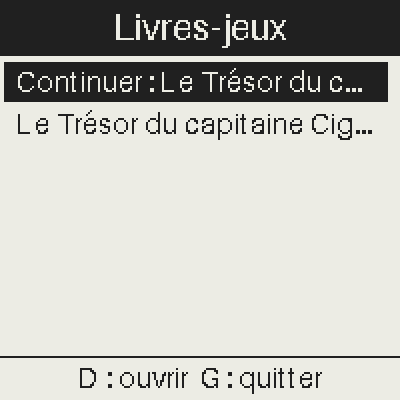

### Livres-jeux — Un livre

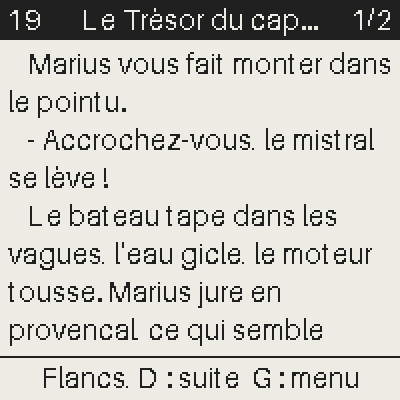

### Livres-jeux — La lecture

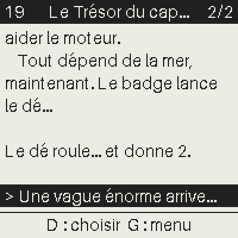

## Jeux

### Menu — Le thème Jeux

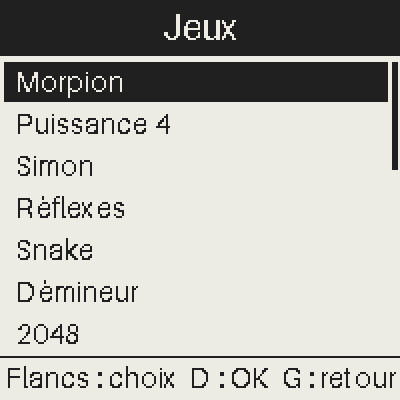

### Morpion

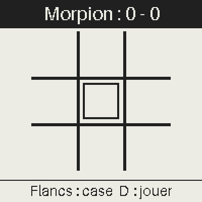

### Morpion — La partie

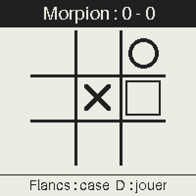

### Puissance 4

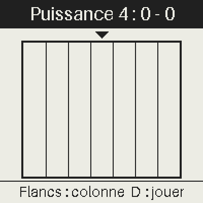

### Puissance 4 — La partie

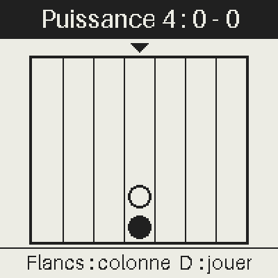

### Simon

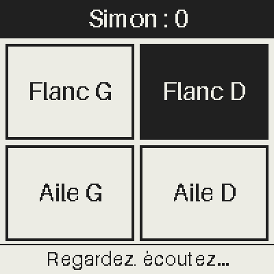

### Simon — La partie

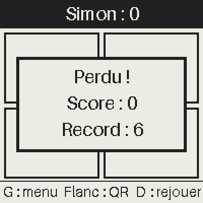

### Réflexes

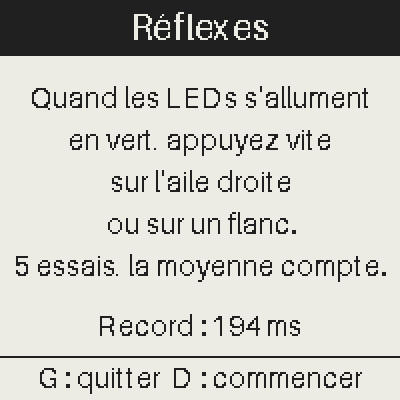

### Réflexes — La partie

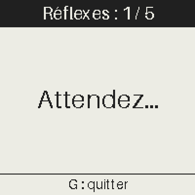

### Snake

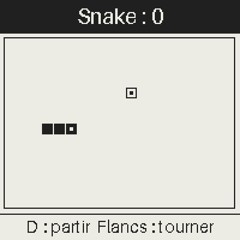

### Snake — La partie

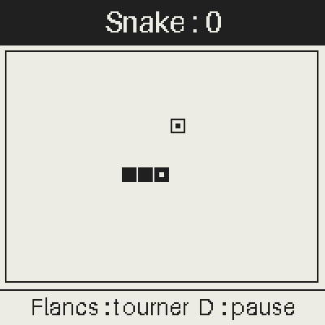

### Démineur

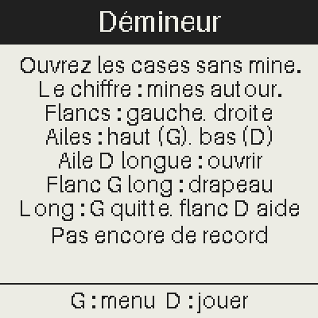

### Démineur — La partie

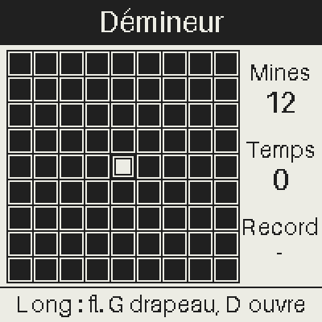

### 2048

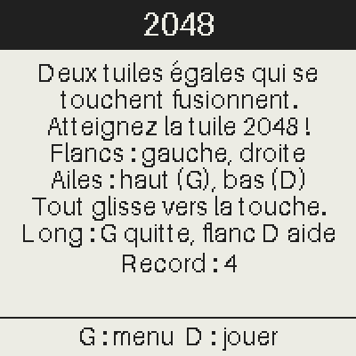

### 2048 — La partie

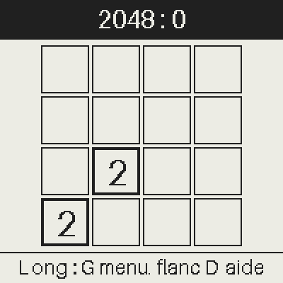

### Taquin

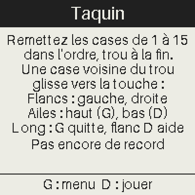

### Taquin — La partie

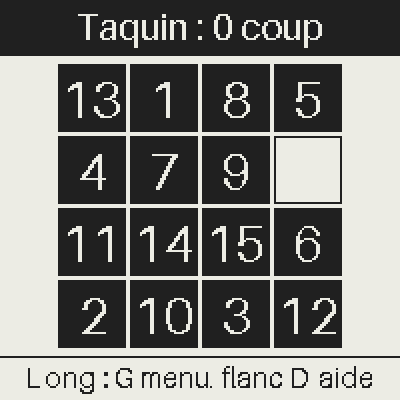

### Sokoban

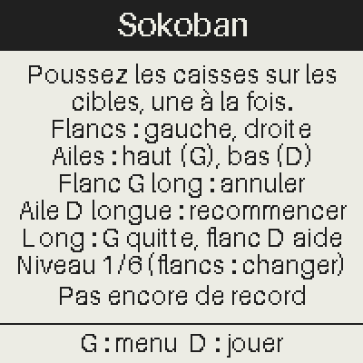

### Sokoban — La partie

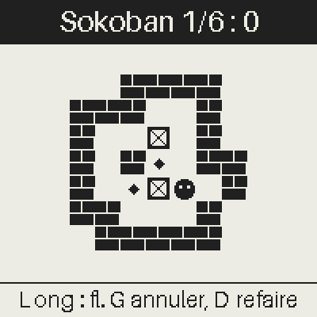

### Mastermind

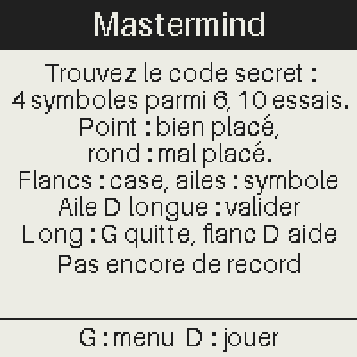

### Mastermind — La partie

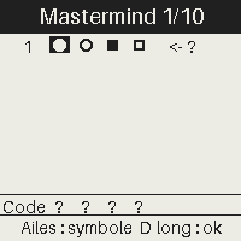

### Pendu

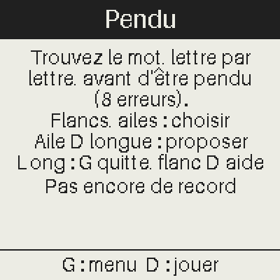

### Pendu — La partie

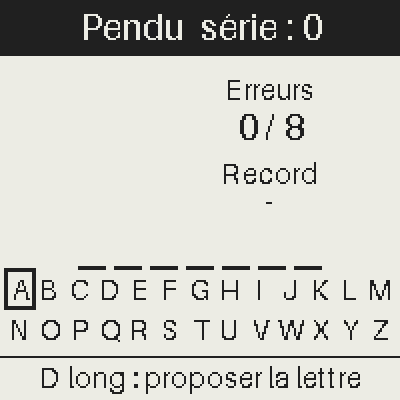

### Blind test

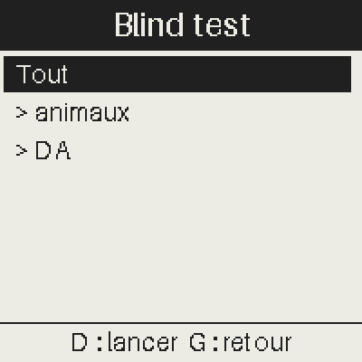

### CTF

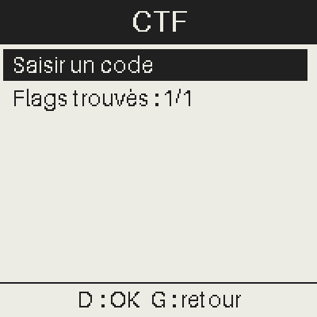

### CTF — Saisie d'un code

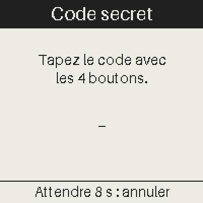

### Défis crypto

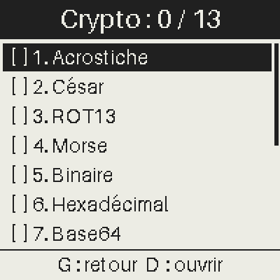

### Défis crypto — Un défi

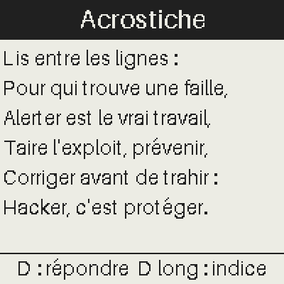

### Défis crypto — Son indice

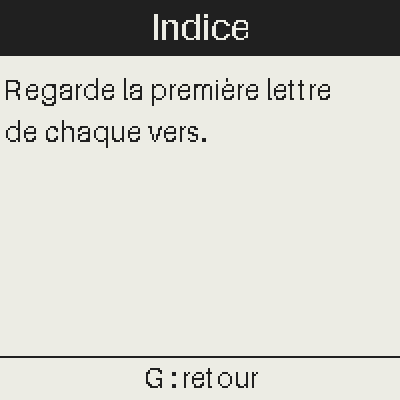

### Défis crypto — La saisie de la réponse

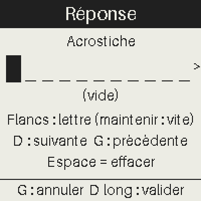

### Défis crypto — Le flag final

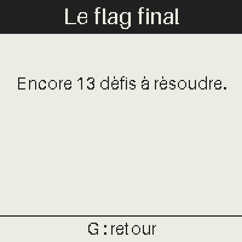

### Duel

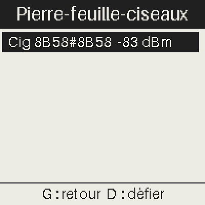

### Bataille navale

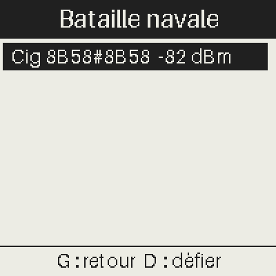

### Loup-garou

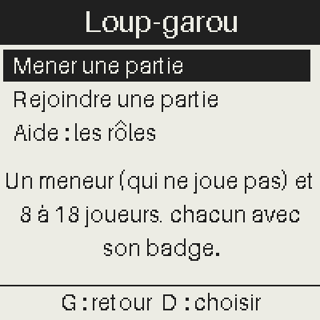

### Loup-garou — Mener une partie

### Loup-garou — Aide : une carte de rôle

### Loup-garou — Aide : le détail du rôle

### Assassin

### Tir à la corde

## Social

### Menu — Le thème Social

### Réseau cigales

### Messages

### Messages — Choix du destinataire

### Messages — Choix du message

### Contacts

### Contacts — Ma carte (champs cochés : envoyés)

### Contacts — Saisie d'un champ

### Contacts — Echange des cartes

### Contacts — Contacts reçus

### Compétences

### Compétences — Mes compétences

### Compétences — Qui les partage ?

### Programme

### Programme — Un talk (et son QR code)

### Vote

### Radar des cigales

### Chaud - froid

### Virus des cigales

### Choeur

### Annonces

### Contrebande

### Contrebande — La cale

## Radio & IR

### Menu — Le thème Radio & IR

### Porteuse

### Décodeur 433 MHz

### Station météo

### Envoyer une image

### Recevoir une image

### Infrarouge

### Chasse 433 MHz

### Écouter la radio pirate

## Badge

### Menu — Le thème Badge

### Badge nominatif

### Lampe

### Lampe — Plus fort

### Badge de talk

### Badge de talk — Vert : tout va bien

### Badge de talk — Orange : 5 min

### Badge de talk — Rouge : fini

### Écran OLED

### Succès

### Succès — Comment obtenir un succès

## Réglages

### Menu — Le thème Réglages

### Veille de l'écran

### Infos

### Crédits

### Crédits — Page 2

### Crédits — Page 3

### Crédits — Page 4

### Crédits — Page 5

### Crédits — Page 6

### Crédits — Page 7

### Crédits — Page 8

### Réglage radio

## Admin

### Menu — Le thème Admin

### Commandes radio

### LEDs des cigales

### LEDs des cigales — Le mode

### LEDs des cigales — Les temps du clignotement

### LEDs des cigales — Les temps du fondu

### LEDs des cigales — Envoyer / rétablir

### Annonces (admin)

### Annonces (admin) — Une annonce : ses champs

### Annonces (admin) — Saisie de l'heure

### Annonces (admin) — Saisie du texte (lettres accentuées)

### Annonces (admin) — Aperçu (l'écran des cigales)

### Vote (admin)

### Choeur : lancer

### Balise chaud-froid

### Virus : patient zéro

### Contrebande (admin)

### Loup-garou (admin)

### Remise à zéro

### Remise à zéro — La confirmation

### Batterie (calibration)

### Radio pirate

### Radio pirate — Les réglages

### Type du badge

## Textes à corriger

(aucun)

## Lignes de listes raccourcies (aperçus : la page de la ligne montre tout)

- Médias > Images : list row cut "Cigale (Hack In Provence).epi"
- Médias > Vidéos : list row cut "Alice au pays des merveilles.EPV"
- Médias > Vidéos : list row cut "Big Buck Bunny (bande-annonce).epv"
- Médias > Vidéos : list row cut "Edgar, le Détective Cambrioleur.EPV"
- Médias > Musique : list row cut "VOXSing_Joyeux anniversaire (ID 2194)_LaSonotheque.fr.wav"
- Médias > Musique > Un dossier de musiques : list row cut "AMBBird_50 oiseaux envolent (ID 1067)_LaSonotheque.fr.wav"
- Médias > Musique > Un dossier de musiques : list row cut "AMBBird_50 oiseaux se couchent (ID 1068)_LaSonotheque.fr.wav"
- Médias > Musique > Un dossier de musiques : list row cut "AMBBird_Oiseaux du soir (ID 1859)_LaSonotheque.fr.wav"
- Médias > Musique > Un dossier de musiques : list row cut "AMBBird_Poulailler (ID 0282)_LaSonotheque.fr.wav"
- Médias > Musique > Un dossier de musiques : list row cut "AMBBird_Reveil des oiseaux 2 (ID 0935)_LaSonotheque.fr.wav"
- Médias > Musique > Un dossier de musiques : list row cut "AMBBird_Reveil des oiseaux 3 (ID 0999)_LaSonotheque.fr.wav"
- Médias > Musique > Un dossier de musiques : list row cut "AMBBird_Reveil des oiseaux 4 (ID 1906)_LaSonotheque.fr.wav"
- Médias > Musique > Lecture d'une musique : list row cut "AMBBird_50 oiseaux envolent (ID 1067)_LaSonotheque.fr.wav"
- Médias > Lecture rapide : list row cut "Declaration des droits de l'homme (1789).txt"
- Médias > Lecture rapide > Un dossier de textes : list row cut "La Fontaine - La Cigale et la Fourmi.txt"
- Médias > Lecture rapide > Un dossier de textes : list row cut "La Fontaine - La Colombe et la Fourmi.txt"
- Médias > Lecture rapide > Un dossier de textes : list row cut "La Fontaine - La Laitière et le Pot au lait.txt"
- Médias > Lecture rapide > Un dossier de textes : list row cut "La Fontaine - La Mort et le Bûcheron.txt"
- Médias > Lecture rapide > Un dossier de textes : list row cut "La Fontaine - La Poule aux oeufs d'or.txt"
- Médias > Lecture rapide > Un dossier de textes : list row cut "La Fontaine - Le Chat, la Belette et le petit Lapin.txt"
- Médias > Lecture rapide > Un dossier de textes : list row cut "La Fontaine - Le Chêne et le Roseau.txt"
- Médias > Livres-jeux : list row cut "Continuer : Le Trésor du capitaine Cigalon"
- Médias > Livres-jeux : list row cut "Le Trésor du capitaine Cigalon"
- Médias > Livres-jeux > Un livre : list row cut "Le Trésor du capitaine Cigalon"
- Médias > Livres-jeux > La lecture : list row cut "Le Trésor du capitaine Cigalon"
- Social > Contacts > Ma carte (champs cochés : envoyés) : list row cut "[x] E-mail : monemail@poste.fr"
- Social > Programme : list row cut "09:30 Ouverture de SecSea 2026"
- Social > Programme : list row cut "10:00 Talk 1 (titre à compléter)"
- Social > Programme : list row cut "11:00 Talk 2 (titre à compléter)"
- Social > Programme : list row cut "14:00 Talk 3 (titre à compléter)"
- Social > Programme : list row cut "15:00 Atelier badge : hackez votre cigale !"
- Admin > Annonces (admin) : list row cut "09:00 Bienvenue à SecSea 2026 ! Accueil et café"
- Admin > Annonces (admin) : list row cut "10:30 Pause café : rendez-vous au bar"
- Admin > Annonces (admin) : list row cut "12:30 Pause déjeuner : bon appétit !"
- Admin > Annonces (admin) : list row cut "14:00 Reprise des conférences"
- Admin > Annonces (admin) : list row cut "17:30 Remise des prix du CTF"
- Admin > Annonces (admin) : list row cut "18:30 Apéro de clôture : merci à tous !"
- Admin > Annonces (admin) > Une annonce : ses champs : list row cut "Contenu : https://www.hackinprovence.fr/"
- Admin > Annonces (admin) > Une annonce : ses champs : list row cut "Texte : Bienvenue à SecSea 2026 ! Accueil et café"
- Admin > Annonces (admin) > Saisie du texte (lettres accentuées) : list row cut "Contenu : https://www.hackinprovence.fr/"
- Admin > Annonces (admin) > Saisie du texte (lettres accentuées) : list row cut "Texte : Bienvenue à SecSea 2026 ! Accueil et café"
- Admin > Annonces (admin) > Aperçu (l'écran des cigales) : list row cut "Contenu : https://www.hackinprovence.fr/"
- Admin > Annonces (admin) > Aperçu (l'écran des cigales) : list row cut "Texte : Bienvenue à SecSea 2026 ! Accueil et café"
