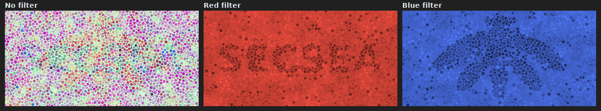

# Images révélées par la lumière rouge ou bleue

Une image en couleurs, sur un écran ou imprimée, qui cache deux motifs : l'un apparaît sous une lumière rouge,
l'autre sous une lumière bleue. Les LEDs des badges font la lampe : une énigme de CTF, un message de bienvenue, une
chasse au trésor dans une salle sombre...

*English version: [color_images.md](../en/color_images.md).*



## Le principe

Sous une lumière d'une seule couleur, seule la part de cette couleur compte, et l'image se lit en niveaux de gris :

| Couleur imprimée ou affichée | sous lumière rouge | sous lumière bleue |
|---|---|---|
| blanc | clair | clair |
| rouge, jaune, orange | clair | **sombre** |
| magenta, rose | clair | clair (un peu moins sur papier) |
| bleu | **sombre** | clair |
| cyan | **sombre** | clair |
| vert, noir | **sombre** | **sombre** |

C'est le vieux tour des « lunettes décodeuses » : un message écrit en bleu, gribouillé de rouge par-dessus, se lit à
travers un filtre rouge, qui rend le rouge aussi clair que le papier. L'outil le fait sur les deux couleurs à la fois,
avec des cellules colorées (points façon test d'Ishihara, taches ou rayures) :

- la **part rouge** d'une cellule dit si elle est dans le motif A (sombre sous la lumière rouge) ;
- sa **part bleue** dit si elle est dans le motif B (sombre sous la lumière bleue), indépendamment ;
- sa **part verte** (l'encre magenta sur papier), qu'aucune des deux lumières ne voit, sert de camouflage : des
  cellules plus ou moins vertes / roses au hasard, des taches douces, et un éventuel **leurre** (`--decoy`), un texte
  que l'œil lit tout de suite et qui disparaît sous les deux lumières.
- un **voile** (`--haze`) : de larges taches floues de rouge et de bleu sur toute l'image. Sous la lumière, l'œil
  lit les bords nets du motif à travers ; à l'œil nu, il voit des variations de teinte partout, pas seulement sur le
  motif.

Sur papier, l'outil calcule directement les encres : cyan pour le motif rouge, jaune pour le motif bleu, magenta
pour le camouflage, sans noir (le noir serait sombre sous les deux lumières). Il corrige l'absorption parasite du
magenta dans le bleu (le magenta réel absorbe une partie de la lumière bleue) en dosant le jaune.

## Les commandes

Python 3 avec Pillow et numpy (`pip install pillow numpy`).

```
python tools/color_reveal.py --text-red SECSEA --image-blue @cicada -o revele.png --preview
python tools/color_reveal.py --text-red SECSEA --text-blue "HIP|2026" --decoy "HELLO" --style blobs -o hip.png --preview
python tools/color_reveal.py --text-red SECSEA --text-blue "HIP|2026" --print --size 150x100mm --dpi 300 -o hip_print.png --preview
python tools/color_reveal.py --image-red logo.png --text-blue "FLAG{...}" --print --cmyk flag_cmyk.tif -o flag.png
```

| Option | Rôle |
|---|---|
| `--text-red`, `--text-blue` | le texte qui apparaît sous la lumière rouge / bleue (`\|` : à la ligne) |
| `--image-red`, `--image-blue` | une image noir et blanc (le noir = le motif, `--invert` pour l'inverse ; la transparence compte comme du blanc), ou `@cicada`, une cigale dessinée |
| `--decoy` | un texte leurre, vu à l'œil nu, absent sous les deux lumières |
| `--style` | `dots` (points, par défaut : le mieux caché), `blobs` (taches : le plus lisible sous la lumière), `stripes` (rayures) |
| `--cell` | la taille des cellules en pixels (par défaut : 1/60 de la hauteur) |
| `--strength` | 0,1 à 1 : le contraste des motifs (0,7 par défaut) ; plus bas, mieux caché mais moins lisible |
| `--haze`, `--noise` | le voile de rouge et de bleu (0,25) et la part de cellules inversées au hasard (0,06) |
| `--size` | `LxH` en pixels (1200x600 par défaut) ou `LxHmm` avec `--dpi` (150x100mm en mode impression) |
| `--print`, `--dpi`, `--cmyk` | couleurs d'encres pour l'impression, la résolution (300 dpi), et un TIFF CMJN (K = 0) pour un imprimeur |
| `--seed` | le tirage au hasard (même graine : même image) |
| `--preview` | écrit aussi `<sortie>_preview.png` : l'image, sa vue sous lumière rouge et sous lumière bleue, côte à côte (une simulation, pour vérifier sans lampe) |

Les exemples de [docs/color_reveal](../color_reveal/) : `secsea_cicada_screen` (écran : SECSEA au rouge, une cigale
au bleu), `secsea_hip2026_decoy_screen` (écran, taches, leurre « HELLO »), `secsea_hip2026_print` (impression
150 x 100 mm à 300 dpi), `secsea_cicada_decoy_print` (impression avec le leurre « CTF »), et leurs `_preview`.

## Imprimer

- **Imprimante** : le jet d'encre donne les couleurs les plus pures (encres transparentes) ; un laser couleur
  marche aussi. Imprimer à 100 % (pas « ajuster à la page » si la taille compte), sans « couleurs vives » ni
  amélioration automatique des photos.
- **Papier** : un papier **mat couché** (ou satiné) est le meilleur compromis : couleurs saturées, et pas de reflet
  de la LED. Le papier glacé (photo) donne les couleurs les plus fortes mais renvoie la lampe en un point brillant :
  éclairer de biais. Le papier de bureau marche, en moins contrasté (l'encre boit et s'étale : garder des cellules
  d'au moins 1,5 mm, ce que donnent les réglages par défaut à 150 x 100 mm).
- **Chez un imprimeur** : donner le TIFF CMJN (`--cmyk`), sans conversion de profil ni remplacement du gris par
  du noir (« GCR / UCR » désactivés) : l'outil n'utilise pas d'encre noire exprès.
- Toujours **essayer une impression** et la regarder sous les LEDs avant d'en tirer beaucoup : chaque couple
  imprimante + papier est différent. Si un motif est trop visible à l'œil nu, baisser `--strength` (0,5) ; s'il
  est trop faible sous la lumière, l'augmenter (0,9) ou grossir les cellules (`--cell`).

## Éclairer le papier

- **Une pièce sombre** : toute lumière blanche autour (fenêtre, plafonnier, écran) délave l'effet. Plus la pièce est
  noire, plus le motif ressort.
- **Les LEDs du badge** : Admin > **LEDs des cigales**, « Couleur » rouge (ou Rouge 255, Vert 0, Bleu 0), « Mode »
  Fixe : les LEDs de ce badge prennent la couleur pendant le réglage ; « > Envoyer aux cigales » allume en rouge
  toutes les cigales autour (pratique pour une salle entière ou un atelier). Puis bleu (0, 0, 255). Tenir le badge
  à 10 - 30 cm de la feuille ; plusieurs badges ensemble éclairent mieux. Hors mode admin, une lampe rouge et une
  lampe bleue font pareil.
- **Une lampe torche** avec un filtre : une gélatine d'éclairage rouge primaire et bleu foncé (filtres de scène)
  marche bien ; la cellophane colorée laisse passer d'autres couleurs (surtout la bleue, qui laisse passer du vert) :
  l'effet est plus faible. Une LED de couleur (rouge, bleue) est toujours plus pure qu'une lampe blanche filtrée.
- **Sans lampe** : regarder la feuille, en lumière blanche, à travers un filtre rouge puis bleu (comme des lunettes
  décodeuses) donne le même effet, en moins contrasté.

## Sur un écran

Un écran émet sa propre lumière : l'éclairer en rouge ne change rien. Il faut **regarder l'écran à travers un
filtre** : rouge pour le motif A, bleu pour le motif B. Les sous-pixels rouge, vert et bleu de l'écran sont bien
séparés, c'est donc le cas le plus propre, si le filtre l'est aussi :

- le verre **rouge** des lunettes 3D rouge / cyan marche très bien ;
- le verre **cyan** ne convient **pas** pour le motif bleu : il laisse passer le vert, donc le camouflage. Il faut un
  filtre bleu qui coupe le vert (gélatine bleu foncé, ou plusieurs couches de cellophane bleue) ;
- couper le mode « lumière nocturne / True Tone / confort des yeux », qui retire du bleu ;
- une photo de l'écran ou du fichier, ouverte dans un éditeur d'images qui montre un seul canal (rouge ou bleu)
  révèle aussi les motifs : un classique des épreuves de stéganographie de CTF (StegSolve, GIMP > Couleurs >
  Composants > Décomposer).

## Les limites

- **Jamais parfaitement invisible à l'œil nu** : le motif est une vraie différence de couleur. Les simulations
  montrent qu'à l'écran, avec les réglages par défaut et des points, un texte est à peine devinable (une vague zone
  plus bleutée ou orangée si on le cherche) ; avec un leurre, l'œil lit le leurre et ne cherche plus. Les grands
  aplats (une cigale pleine, un anneau) se devinent davantage qu'un texte en traits fins.
- **Le papier cache moins bien que l'écran** : l'encre cyan du motif rouge reste visible en petits points
  bleu-vert, et le camouflage magenta est limité pour ne pas assombrir la vue bleue. Utiliser `--decoy` et une
  `--strength` de 0,5 à 0,6 sur papier.
- **Les simulations sont approximatives** : elles supposent une lumière rouge et une bleue pures et des encres
  moyennes. Les vraies encres, le papier, l'écran et les filtres changent le résultat : toujours vérifier en vrai.
- Le motif rouge et le motif bleu peuvent se superposer sans se gêner ; là où les deux sont présents, la cellule
  est verte ou sombre.
- Une personne daltonienne ne verra pas l'image à l'œil nu comme les autres (parfois mieux le motif, parfois moins).

## Sources

- [Museums Victoria, *Hidden messages in colour*](https://museumsvictoria.com.au/scienceworks/at-home/play/hidden-messages-in-colour/) :
  pourquoi le rouge disparaît derrière un filtre rouge et le bleu y devient sombre.
- [Rainbow Symphony, *Secret Message Glasses*](https://www.rainbowsymphony.com/blogs/blog/are-decoder-glasses-really-a-thing) :
  message cyan caché par des rouges (filtre rouge), message jaune (filtre bleu).
- [Curiokids, *Decode messages with a red filter*](https://curiokids.net/en/decode-messages-with-a-red-filter/) et
  [Fleet Science Center, *Hidden Messages*](https://www.fleetscience.org/sites/default/files/Hidden%20Messages%20(Printable%20Instructions).pdf).
- Brevets Xerox sur le « multiplexage spectral » (plusieurs images dans une impression, chacune révélée par un
  éclairage) : [US 7379588](https://image-ppubs.uspto.gov/dirsearch-public/print/downloadPdf/7379588),
  [US 7269297](https://image-ppubs.uspto.gov/dirsearch-public/print/downloadPdf/7269297) (qui décrit aussi
  les absorptions parasites des encres, le magenta surtout).
- [US 10453162](https://image-ppubs.uspto.gov/dirsearch-public/print/downloadPdf/10453162) : sous une lumière
  rouge, les zones sans encre absorbant le rouge paraissent blanches, les encres vertes et bleues noires.
