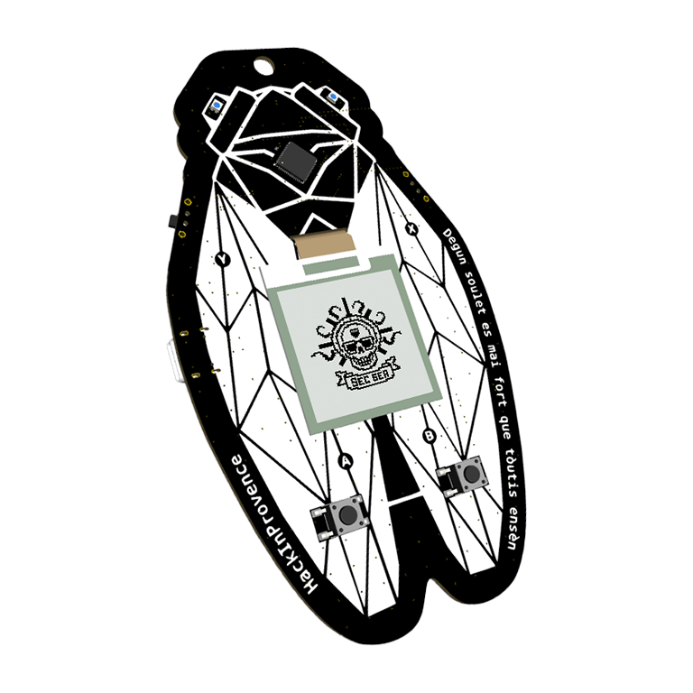
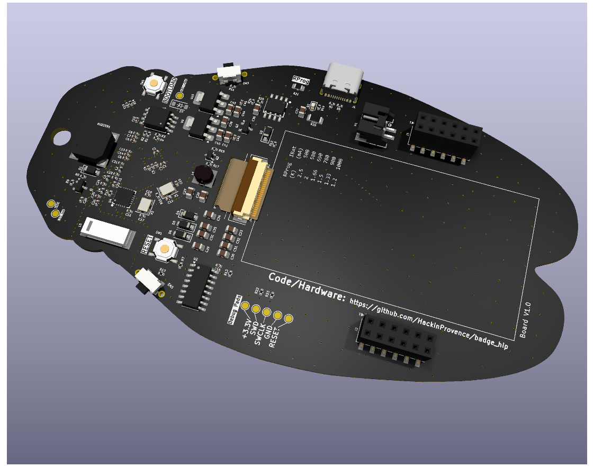
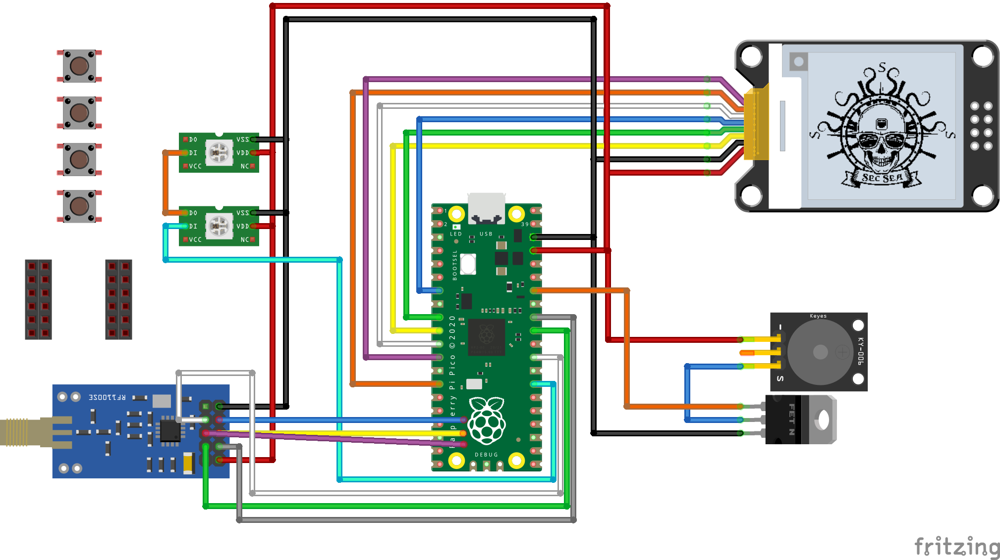
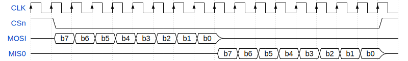
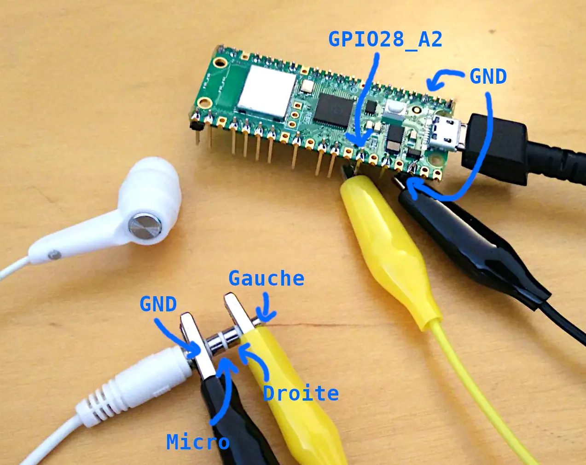

# Présentation du badge

Le badge utilise le coeur du Raspberry Pi Pico (RP2040),
et utilise ses nombreuses fonctionnalités pour connecter d'autres modules matériels :

- flash 16Mo,
- 4 boutons,
- 1 buzzer,
- 2 LEDs WS2812 (yeux de la cigale),
- gestion charge batterie,
- radio CC1101 en SPI,
- écran e-Paper 200x200 en SPI,
- possibilité d'ajouter d'autres modules via GPIO, I2C et un chipselect sur SPI0.





Voici une vue schématique et **inexacte** du badge que l'on construit
(inexacte car nous partons du RP2040 au lieu d'un pico et tout n'y est pas connecté) :



Presque tous les pins d'entrée/sortie sont utilisés.
Ceux restant sont exposés sur les ports d'extension.

Le RP2040 est un microcontrôleur conçu par Raspberry.
Il abrite 2 coeurs Cortex M0+ cadencés à 125MHz, mais seulement 264ko de RAM.
Il contient des périphériques hardware bien pratiques : PWM, UART, I2C, SPI, Timers.

Un périphérique remarquable et unique en son genre est le PIO.
Le PIO exécute un programme dans son langage proche de l'assembleur,
et dont chaque instruction s'exécute en 1 cycle.
Il peut piloter des IO à de multiples cadences et peut implémenter des protocoles électriques aux exigences variées,
comme le WS2812, sans consommer de temps CPU.
Il s'adapte à des temps de l'ordre de la milliseconde jusqu'aux nanosecondes (125MHz -> 8ns).

Le RP2040 sur le badge est compatible avec le SDK utilisé pour le Pico.
Le badge est flashé de la même manière que le pico (fichiers UF2, bouton BOOTSEL).
D'une manière générale, ils sont compatibles, même si leurs GPIO n'auront pas les mêmes rôles.


## SP quoi ? Communication MCU <-> périphériques

Au niveau le plus haut, on peut voir la communication entre le coeur et les périphériques comme ceci :

```
                                      
                                      
   ┌───────┐           ┌──────────┐   
   │       │           │          │   
   │  MCU  │◄─────────►│  Module  │   
   │       │           │          │   
   └───────┘           └──────────┘   
                                      
                                      
```

Un ou plusieurs fils les relient et ils échangent des données dessus par des signaux électriques.

Il existe une multitude (infinité ?) de manière de communiquer.
Souvent en électronique, cette communication se fait en binaire en faisant varier la tension sur un fil (0 = 0V, 1 = 3.3V ou 5V).
L'un définit la tension sur le fil, l'autre écoute.

Il existe deux familles de communications : en série (les bits/bauds arrivent les uns à la suite des autres, e.g. UART, SPI, USB, ...)
ou en parallèle (les bits sont transmis en même temps sur plusieurs fils, e.g. PCI, RAM, ...).


### UART

L'UART (et ses ancêtres comme le RS-232) est un protocole série Asynchrone.
Il y a un fil de communication dans chaque sens :

```
                                      
                                      
   ┌───────┐Tx       Rx┌──────────┐   
   │       ├──────────►│          │   
   │  MCU  │           │  Module  │   
   │       │◄──────────┤          │   
   └───────┘Rx       Tx└──────────┘   
                                      
                                      
```

Le timing de communication, en bauds par seconde, et d'autres paramètres sont définis à l'avance.
On peut schématiser par exemple la transmission d'un octet :


### SPI

Le SPI est un autre protocole série très répandu.
C'est un bus de données où plus de deux périphériques peuvent communiquer.
Le Contrôleur (souvent appelé Maître) commande un ou plusieurs Périphériques (Slaves).

Il fonctionne avec 1 ligne d'horloge (SCK, CLK),
1 ligne Contrôleur vers Périphériques (COPI, MOSI),
1 ligne Périphériques vers Contrôleur (CIPO, MISO),
1 ligne de sélection par périphérique (CSn) :

```
                                          
                               ┌────────┐ 
                    ┌─────────►│        │ 
                    │ ┌───────►│  Mod1  │ 
 ┌────────────┐     │ │ ┌──────┤        │ 
 │        CLK ├─────┤ │ │ ┌───►│        │ 
 │        MOSI├─────┼─┤ │ │ CSn└────────┘ 
 │  MCU   MISO│◄────┼─┼─┤ │               
 │        CSn1├─────┼─┼─┼─┘               
 │        CSn2├─────┼─┼─┼─┐    ┌────────┐ 
 └────────────┘     └─┼─┼─┼───►│        │ 
                      └─┼─┼───►│  Mod2  │ 
                        └─┼────┤        │ 
                          └───►│        │ 
                            CSn└────────┘ 
                                          
```

La CLK sert à synchroniser les échanges.
Les CSn servent à cibler la commande donnée sur MOSI à l'un ou l'autre des périphériques
(ceux qui ne sont pas sélectionner doivent ignorer ce qu'ils reçoivent).
C'est toujours le Contrôleur qui choisit le CSn et initie la communication.
Il y a également plusieurs modes de communication, suivant qu'on lit la donnée sur le front montant ou descendant de l'horloge,
que l'horloge reste active entre communications, ...

Voici un exemple où le Contrôleur envoie un octet et le Périphérique répond un octet :




### WS2812

Ce protocole est répandu pour contrôler les LEDs RGB.
Il n'utilise qu'un fil.
C'est un protocole série en cascade : chaque LED garde les 24 premiers bits qu'elle reçoit
mais fait passer tous les bits suivants aux autres LEDs.

Ce protocole est plus difficile à représenter, car les 0 et 1 ne sont pas simplement encodés par le signal niveau bas ou haut,
et l'encodage du 0 et du 1 n'ont pas la même durée.
Le 0 est encodé par un signal niveau haut pendant 350ns puis un signal bas pendant 800ns (à +/- 150ns),
alors que le 1 est encodé par haut 700ns puis bas 600ns.

Pour que la première LED puisse savoir qu'on s'adresse à elle de nouveau (et non à une suivante),
on doit laisser le signal à bas pendant au moins 50µs (50 000ns).

Le pilotage des LEDs est souvent un problème pour les microcontrôleur,
car par exemple 200 LED nécessitent 260µs pendant lesquels il faut respecter un timing précis.

Si on le fait faire par un CPU via du logiciel, on appelle ça du bit banging.
Dans le cas d'un microcontrôleur avec OS, comme les Raspberry Pi, c'est un challenge que le programme ne soit jamais interrompu par l'OS,
qui est par nature multi-tâches.
On obtient des clignotements des premières LEDs, ou on n'arrive jamais au bout du ruban...
Avec un Arduino, on peut monopoliser son attention pour réussir la programmation, mais on ne peut rien faire d'autre pendant ce temps.

Avec le RP2040, on peut programmer le PIO pour réaliser ces mises à jour (presque) sans consommer de temps CPU.
Le PIO s'occupe de gérer les timings sur le fil de signal pendant que le CPU pousse les données à envoyer.
Le CPU est interrompu lorsqu'on peut envoyer de nouvelles données mais cette opération est très rapide pour le CPU.
On peut même configurer le DMA pour faire cette opération à la place du CPU et ne plus être interrompu.


## Configuration du MCU : les registres

Le MCU est un système déjà complexe, composé de plusieurs coeurs et de périphériques :

```
┌────────────────────────────────────────────────────┐         
│  RP2040                               ┌──────────┐ │         
│                                       │          ├─┼───► CLK 
│                                       │  Driver  ├─┼───► MOSI
│                                  ┌───►│   SPI    │◄┼──── MISO
│                                  │    │          ├─┼───► CSn 
│ ┌─────────┐                      │    └──────────┘ │         
│ │         │         ┌───────┐    │                 │         
│ │  Core0  │◄───────►│       │◄───┘    ┌──────────┐ │         
│ │         │         │       │         │          │ │         
│ └─────────┘         │   B   │         │  Driver  ├─┼───► Tx  
│                     │   U   │◄───────►│   UART   │◄┼──── Rx  
│                     │   S   │         │          │ │         
│ ┌─────────┐         │       │         └──────────┘ │         
│ │         │◄───────►│       │◄───┐                 │         
│ │  Core1  │         └───────┘    │    ┌──────────┐ │         
│ │         │                      │    │          │ │         
│ └─────────┘                      └───►│   ...    │ │         
│                                       │          │ │         
│                                       └──────────┘ │         
│                                                    │         
└────────────────────────────────────────────────────┘         
```

Les drivers sont des composants hardware qui réalisent une activité sans intervention des coeurs de calcul.
En plus de ceux cités, on peut ajouter le PWM, le DMA (Direct Memory Access) pour réaliser des transferts de données,
l'I2C, l'UART, des Timers, une RealTimeClock, l'USB, ...
Toutes ces fonctions sont détaillées dans la [datasheet du RP2040](https://datasheets.raspberrypi.com/rp2040/rp2040-datasheet.pdf)

Au niveau logiciel, la configuration de ces drivers est abstraite.
Il serait trop compliqué et trop lent d'inventer encore un protocole pour communiquer avec le bus.

A la place, on utilise des *registres* de configuration.
Pour le logiciel, il s'agît d'un espace mémoire comme un autre, accessible en lecture et/ou écriture.
Les accès sur ces registres sont traduites par le bus pour configurer les drivers hardware.

Par exemple, écrire 1 sur le bit 0 de l'adresse 0x50200000 met en route une machine à état du PIO.
Lire 32 bits de l'adresse 0x50200020 enlève et renvoie ces 4 octets de la fil d'attente d'une machine à état du PIO.
Ou encore, écrire 12 bits sur 0x4005002c règle la cadence du PWM pour les GPIO 4 et 5.

Tous ces registres ont des noms dans la datasheet du RP2040,
et dans le SDK en C qui contient également des fonctions pour faciliter leur usage,
d'où l'intérêt d'utiliser le SDK...


# Activités

## Prise en main de la toolchain

Nous écrirons nos programmes en C.
Des programmes en MicroPython sont disponibles sur le net,
ainsi que les explications pour les exécuter.

Prenez le temps d'installer le SDK pour pouvoir compiler et flasher votre pico/badge.
Il y a deux options principales :

- utiliser VSCode (Windows ou Linux) et les extensions Raspberry Pi Pico et CMake Tools,
- utiliser le SDK via CMake (principalement Linux).

Les instructions d'installation sont résumées dans le [README du projet](../README.md#pico-c-sdk).


## Pilotage du buzzer

Le buzzer est sur le pin `GPIO28_A2`.
Suggestion pour tester avec des écouteurs filaires (ici stéréo + micro donc la prise jack a 4 bandes) :



Vous pouvez également vous en sortir avec une seule pince croco (la masse),
et presser le bout du jack contre le pin 28.

**Attention** : ne pas mettre les écouteurs dans les oreilles, le volume est très fort.

Pour tester ce montage, allez voir les deux exécutables de test : [`tests/noise_gen.c`](../src/tests/noise_gen.c) et [`tests/music.c`](../src/tests/music.c).

Pour la musique, imaginez comment modifier la lib pour passer une callback dans `userdata` géré par `alarm`.
Ainsi, on peut compter les notes, et laisser la possibilité de synchroniser d'autres éléments avec le son :

- les LEDs,
- les paroles sur l'UART.

Concevez un système similaire pour `noise_gen`.
Il s'agît surtout de séparer les silences des bruits...


## Pilotage de LEDs (WS2812)

**Attention** : pour piloter les LEDs, il faut les alimenter en 5V par *une alimentation externe*.
Merci de **_ne pas_ utiliser** le pin 3V3 du pico, il y a un risque de le griller.

Vous pouvez cependant utiliser *VSYS* ou une alimentation externe.
Comme chaque LED consomme de l'ordre de 80mA, et que l'USB fournit 500mA mais que le pico peut en consommer 100,
il est préférable de **ne pas dépasser 5 LEDs**.

Basez-vous sur l'[exemple Pico WS2812](https://github.com/raspberrypi/pico-examples/blob/master/pio/ws2812/ws2812.c).
Notez également que la bibliothèque `pico/status_led` du SDK sait piloter une WS2812.

Commencez par comprendre comment fonctionne le C.
Dans un premier temps, supposez que la machine à état définie dans le fichier `.pio` est une boîte noire qui prend ses données quelque part et les pousse vers le ruban de LED.
Notez une fonction `pio_sm_put_blocking`, il s'agît de la fonction poussant les données au PIO.

Remplacez la boucle `while` par un code plus simple permettant de régler la couleur de 2 LEDs.
Essayez divers couleurs.
Essayez de faire "vibrer" les yeux de la cigale.

Idéalement, avec le son émit par `noise_gen`...


## Pilotage écran e-Paper

Je n'ai pas encore trouvé de bibliothèque pour piloter l'écran depuis le RP2040 en C.

Il existe cependant des solutions Arduino qui devraient fonctionner,
comme celle présentée [sur le site du constructeur](https://www.waveshare.com/wiki/1.54inch_e-Paper_Module_Manual).
A tester !

Mapping des pins pour le prg Arduino et vérif.
Il faut suivre dans les sources les `#define` dans les sources du projet Arduino + les headers d'adaptation pour le RP2040 + vérif la spec RP2040 éventuellement...

- VCC -> 3V3 plutôt que VSYS qui est à 5V
- GND
- DIN -> 19 : la lib n'utilise que Tx, donc MOSI, qui est `PIN_SPI0_MOSI = 19` (c'est bien ce pin sur le RP2040)
- SCK -> 18 : `PIN_SPI0_SCK = 18` (ou 22 d'après la datasheet, mais c'est 18 qui est set par la lib sur cette fonction)
- CS -> 17 : `PIN_SPI0_SS = 17` (pourquoi `_SS` ? parce que SSPFSSOUT),
  attention dans `EpdIF`, on bagote le CS à la main, et ce n'est pas le bon pin dans le epdif.h
  -> il faut ne pas utiliser ce pin, car `spi_` du RP2040 s'occupe du CS,
  -> mais comme epdif s'en sert, il faut ne rien mettre dessus.
- DC -> 9 : `DC_PIN` dans `epdif.h`
- RST -> 8 : `RST_PIN` dans `epdif.h`
- BUSY -> 7 : `BUSY_PIN` dans `epdif.h`

Il semble qu'on soit en frame format Motorola avec SPO=0 et SPH=0.


## Pilotage RF (CC1101)

Le module RF CC1101 est configurable en SPI.

De la même manière, il existe plusieurs bibliothèques, mais pas en C pour le RP2040.
A tester, comprendre, et réaliser un premier exemple,
idéalement accompagné d'un flipper !


## Challenge Ph0wn 2025

Merci à Paul (@BetterCallPaul/@8CtoPuX) et Axelle (@cryptax) pour le don de ce challenge.
Le challenge est à l'origine une carte électronique complète basée sur le RP2040 + flash avec 2 LEDs.

Attention, vous pourriez trouver la solution en ligne alors ne creusez pas trop...

Le firmware présent dans ce dossier `firmware.0.15.uf2` est flashable sur votre pico.
Pour interagir avec le chall, vous devez ouvrir un lien série via l'USB.
Sous linux, avec `minicom -D /dev/ttyACM0` ou `screen /dev/ttyACM0` (ou tout autre logiciel gérant l'UART).
Sous windows, avec PuTTY en mode lien série (probablement sur COM0).

Avant de vous lancer dans le reverse engineering, demandez vous (ou demandez moi) pourquoi j'ai ajouté le `.bin`.
Vous obtiendrez la réponse en étudiant le format UF2.
Vous pouvez d'ailleurs obtenir le `.bin` à partir du `.uf2`.

Une autre question à étudier : comment fonctionne le RP2040 avec une flash ?
Ceci vous aidera à trouver les paramètres nécessaires pour commencer l'analyse sous Ghidra : architecture CPU, adresse de base, ...
